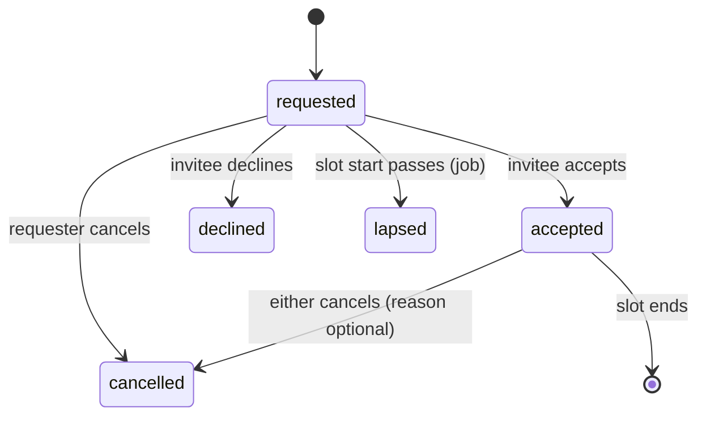

# 2 · Domain

Everything in this chapter lives in `packages/domain`: plain TypeScript with no I/O,
no framework, no database types. It is what the server runs to decide and the client
runs to predict. Words follow the [glossary](glossary.md).

## Modules

Nine modules, each owning its aggregates, its policies and the change types it
records. A module reads another module's data only through that module's public
queries, and reacts to another module's changes instead of calling into it.

| Module            | Owns                                                                                                                        | Records changes such as                                                              |
| ----------------- | --------------------------------------------------------------------------------------------------------------------------- | ------------------------------------------------------------------------------------ |
| **events**        | Event, Day, phase windows, time zone, per-event settings (identity mode, public schedule, RSVP visibility, capacity policy) | EventCreated, DayChanged, PhaseWindowChanged, EventSettingChanged                    |
| **venue**         | Place (room, area, meeting point, anywhere), floor, directions, capacity, colour, map pin; the venue map                    | PlaceCreated, PlaceChanged, VenueMapChanged                                          |
| **people**        | Person, profile (prompts, avatar, languages, contacts, labels), Participation (person × event, role), profile comments      | ProfileChanged, ParticipationAdded, RoleChanged, ProfileCommentAdded                 |
| **identity**      | Credentials (password, passkeys), email codes, join tokens, login sessions, API tokens, assurance rules                     | LoginStarted, CredentialChanged, ApiTokenIssued (audience: the person / admins)      |
| **proposals**     | Proposal, hosts, Vote, proposal comments, attendance prediction                                                             | ProposalCreated/Changed/Deleted, HostAdded/Removed, VoteCast/Withdrawn, CommentAdded |
| **scheduling**    | Session (kinds), hosts, RSVP, booking rules, reserved windows, attendance count                                             | SessionPlaced/Moved/Changed/Deleted, RsvpAdded/Removed, AttendanceRecorded           |
| **meetings**      | Meeting (1-on-1), availability, meeting settings                                                                            | MeetingRequested/Accepted/Declined/Cancelled/Lapsed, AvailabilityChanged             |
| **personal**      | Mark (star, hide, note) on any subject; personal preferences (time format, notification prefs)                              | MarkSet/Cleared, PreferenceChanged (audience: the person only)                       |
| **notifications** | Notification, channel bindings, delivery attempts                                                                           | NotificationCreated, NotificationRead, DeliveryAttempted (audience: the person only) |

The dependency direction among modules (view `modules` in the diagrams):

```
identity ─► people ─► events ◄─ venue
                        ▲          ▲
             proposals ─┤          │
                        │          │
            scheduling ─┴──────────┘        personal ─► scheduling, proposals, people (references only)
              meetings ─► events, venue, people
         notifications ─► (reacts to everything; nothing depends on it)
```

`notifications` and `personal` are leaves: they depend on others, nothing depends on
them. Anything one module must do because of what happened in another is a
reaction to a recorded change (`notifications` reacting to `SessionMoved`), so
the depended-on module never learns about its dependants.

## Aggregates and invariants

An aggregate is the unit a use case loads, checks and saves in one transaction. The
invariants listed are the ones a policy or the aggregate itself must guarantee;
everything else is validation on the contract.

### Event, Day

- Phase is **derived**: `phaseAt(event, instant)` returns proposal / voting /
  scheduling / none from the windows. Never stored, so the fake clock and tests
  need no state.
- A Day has a `bookableWindow` (start, end), a `slotGrid` (slot length, break
  length, first slot start), and optional `mealWindows`. The grid drawn on screen
  and the "slot" a booking refers to are both derived from this; sessions store
  real instants, so a session that starts after a ten-minute break is drawn at its
  real time and the row labels are slot starts. The mismatch attendees reported
  cannot recur because there is no second copy of the grid.
- Event settings that other modules consult are read through one query,
  `eventSettings(eventId)`, never duplicated.

### Place, Venue

- `kind`: `room` | `area` | `meetingPoint` | `anywhere`. `uses`: which of
  `sessions`, `meetings` may be placed here. Today's separate meeting points become
  places with `uses = [meetings]`.
- `floor`, `directions` (markdown, short), `mapPin` (x, y on the venue map, 0–1),
  `capacity`, `bookable`, `colour`.
- `anywhere` is a real place per event with no capacity; a session placed there
  must carry a `gatheringPoint` text.

### Person, Participation

- A Person is site-wide; a Participation is per event and carries the event role
  (`attendee` | `organizer`) and event-scoped settings such as "my RSVPs are
  anonymous by default".
- `siteAdmin` is a site role on the person.
- Profile comments belong to the subject person, who may remove them (#901).

### Proposal, Vote

- Hosts are participations. A proposal with no host is editable by any attendee
  (unclaimed ideas can be picked up); `lookingForCoHosts` is a flag (#775).
- `createdBy` is kept and shown (attendees asked who proposed something); it is
  not a host.
- One vote per participation per proposal; casting the same choice again withdraws.
- Vote choice is visible only to the voter; the breakdown is visible to hosts, and
  to everyone for a host-less proposal. It is a query fetched when a proposal is
  opened, not part of the snapshot. The prediction is a pure function of the
  breakdown, turnout and the event's `concurrency` setting.

### Session

```
Session {
  kind: 'session' | 'shift' | 'fixture'
  title, description (markdown), tags
  hosts: ParticipationId[]            // empty allowed for shifts and fixtures
  proposalId?                         // a proposal may be scheduled more than once
  place: PlaceId, gatheringPoint?     // required when place.kind = anywhere
  start, end: Instant
  capacity?: number                   // absent = unlimited; 0 not allowed
  minHeadcount?: number               // shifts: "needs 2"
  latecomers: 'welcome' | 'closed' | 'unspecified'
  rsvp: 'optional' | 'required' | 'none'   // fixtures default to none
  lockedByOrganizer: boolean          // hosts cannot change it
  createdBy, version
}
```

- Invariants: `end > start`; `start` and `end` on the same Day; `place.uses`
  includes `sessions`; a shift has `minHeadcount ≥ 1`; a fixture has no hosts.
- A fixture is on **everyone's** agenda by default (meals, opening, closing) and
  can be hidden by a personal mark. It defaults to `rsvp = none`, but may carry a
  capacity and take RSVPs like any session (a dinner with limited seats).
- "Which shifts still need people" is `shiftsBelowMinimum(sessions, rsvps)`, a pure
  derived view, so it is one list in the UI and one line in a reminder.
- An **RSVP** is `{ session, participation, visibility: public | anonymous }`.
  Capacity is checked by the policy against the count of RSVPs; hosts do not
  count. Anonymous RSVPs count and show as "+1".

### Booking rules and reserved windows

```
BookingRules {
  maxSessionLength, minSessionLength
  bookablePlaces: PlaceId[]              // per day override possible
  reservedWindows: ReservedWindow[]
}
ReservedWindow {
  places: PlaceId[] | 'all', from, to: Instant
  restriction:
    | { kind: 'organizerOnly' }
    | { kind: 'spontaneousOnly', bookableFrom: Duration }   // e.g. 1h before the window starts
    | { kind: 'maxLength', length: Duration }
}
```

"Someone moved a scheduled session into the slots reserved for spontaneous ones" is
the policy `canPlace` denying a move into a `spontaneousOnly` window before
`bookableFrom`. Organizers configure the rule; the software enforces it.

### Meeting

```
Meeting { requester, invitee: ParticipationId, slot: {start, end}, place: PlaceId,
          state, cancelReason?, createdAt }
```



- Invariants: requester ≠ invitee; both participate in the event; both marked
  available for the slot; `place.uses` includes `meetings`; an open-request cap per
  requester from the event's meeting settings.
- Meetings are visible only to the two persons (and organizers on request); they
  are never in the event-wide audience.
- 1-on-1s are **on by default** for a new event (feedback), with the organizer able
  to turn them off, and are offered only while the event is in a phase the
  organizer chose (default: scheduling, per #952).

### Mark (personal)

```
Mark { participation, subject: {type: 'session'|'proposal'|'person', id}, kind: 'star'|'hide'|'note', text? }
```

- Private by construction: the change audience is the person alone; the snapshot
  includes only the viewer's marks. There is no query that returns another
  person's marks, so a bug cannot leak them by omission of a filter.
- `star` on a session puts it on the agenda without counting; `hide` removes it
  from the default views; `note` is free text. A star on a person is the "people I
  want to meet" shortlist (#773).

### Notification

`Notification { person, category, subject, title, body, createdAt, readAt? }`
plus `ChannelBinding { person, channel, address, verifiedAt }` and
`DeliveryAttempt { notification, channel, at, outcome }`. Categories are an enum
shared with preferences so a new one is added in one place.

## Policies

A policy is `(actor, subject, context) → { allow: true } | { allow: false, reason }`.
They are the only place a rule is written. The server calls them before every
mutation; the client calls them to enable or disable controls and to predict
optimistic changes. Because both sides run the same function, "the button was
enabled but the server refused" becomes a bug with one cause.

| Policy                       | Decides                                                                                                                                                              | Inputs beyond actor and subject                  |
| ---------------------------- | -------------------------------------------------------------------------------------------------------------------------------------------------------------------- | ------------------------------------------------ |
| `phase.allows(action)`       | Whether proposing, editing proposals, voting, scheduling, RSVPing are open now                                                                                       | event, clock                                     |
| `proposals.canEdit`          | Host, or anyone if no host; organizer always; phase                                                                                                                  | proposal                                         |
| `scheduling.canEditSession`  | Host and not `lockedByOrganizer`; organizer always; a started session keeps its start                                                                                | session, clock                                   |
| `scheduling.canPlace`        | Booking window, bookable place, length, reserved windows, place uses; only fields actually changed are held to the rules (an organizer-placed session stays fixable) | day, place, rules, previous session state, clock |
| `scheduling.canRsvp`         | Phase, participation, `rsvp ≠ none`, capacity mode (hard limit vs advisory), not a host                                                                              | rsvp count, event settings                       |
| `scheduling.clashes`         | Which of a person's agenda items overlap a candidate; returns all of them (#1042)                                                                                    | agenda                                           |
| `meetings.canRequest`        | Enabled, phase, availability of both, open-request cap, place use                                                                                                    | meeting settings, availabilities, open count     |
| `people.canEditProfile`      | The person, or organizer for labels only; profile comments removable by subject or author                                                                            |                                                  |
| `identity.assuranceRequired` | Whether this action needs a verified session: the event's minimum, raised by the person's own protection                                                             | event identity mode, person's protection flag    |
| `visibility.audienceOf`      | For each change type, who may see it                                                                                                                                 | change                                           |
| `visibility.canView`         | Vote breakdown (hosts / everyone if host-less), meeting (the two), marks (owner), attendance count (hosts), profiles (participants)                                  | subject                                          |

Policies take a `clock` argument rather than reading time, which is what keeps the
fake clock and the tests honest.

## Derived views

Pure functions from replica-shaped data to what a screen or an email shows. In
`domain` so the server can reuse them (a reminder email listing unfilled shifts uses
the same function as the screen).

- `agenda(viewer, sessions, rsvps, marks, meetings, fixtures)` → ordered items with
  `source: host | rsvp | star | fixture | meeting` and clash groups.
- `shiftsBelowMinimum`, `sessionsNow(clock)`, `grid(day, sessions, places)` with
  column packing, `filters` (mine, starred, unhidden, place, tag, text).
- `prediction(breakdown, turnout, concurrency)`.

## Time model

- Instants are stored and transported as ISO-8601 UTC strings. Every Event has an
  IANA zone. Days are local dates in that zone.
- `domain/time` has the only formatting functions: `formatTime(instant, zone,
prefs)` honouring the person's 12/24-hour preference (#607) and locale, and the
  grid maths. Nothing else formats a time. An ambient-clock ban (`new Date()`) and
  an ambient-zone ban (`toLocaleTimeString` without a zone) are lint rules.
- The `Clock` is a port. Production reads the system clock; the dev toolbar sets a
  per-actor offset (today's fake clock, kept); tests inject fixed instants.

## Language and accessibility as domain concerns

User-visible strings are keys from the start, with English as the source catalog.
The domain returns **reason codes** from policies, never sentences; the client and
email templates translate. This costs nothing now and avoids the rewrite that
adding a second language to sentence-returning code always is.
